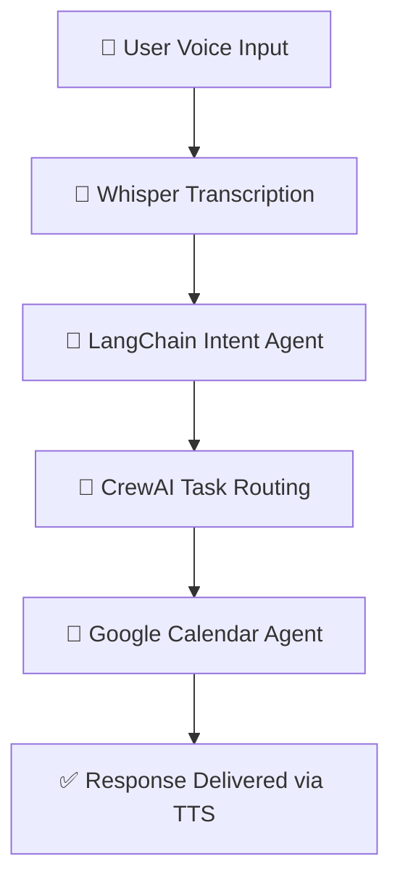

# SmaranAI - Voice Calendar Assistant

**SmaranAI** is a powerful voice-controlled calendar assistant that allows you to manage your Google Calendar using natural language voice commands. It’s built with cutting-edge technologies including OpenAI’s Whisper, LangChain, and CrewAI to deliver an intelligent, agent-based scheduling experience.

---

## ✨ Features

* 🎤 Voice command processing using **OpenAI Whisper**
* 🗣️ Natural language understanding via **LangChain Agents**
* 🤖 Multi-agent task orchestration with **CrewAI**
* 📅 Seamless **Google Calendar** integration
* 🔊 Spoken responses using **Text-to-Speech**
* ⏰ Smart date & time parsing using **AI models**
* 🔄 Real-time calendar updates

---

## 🧰 Prerequisites

* Python 3.10 or higher
* [Google Cloud Platform](https://console.cloud.google.com/) account with **Google Calendar API** enabled
* OpenAI API key (for Whisper, LangChain, and LLMs)


---

## ⚙️ Installation

1. **Clone the repository**:

   ```bash
   git clone https://github.com/Rish-23072005/SmaranAI.git
   cd SmaranAI
   ```

2. **Create and activate a virtual environment**:

   ```bash
   python -m venv venv
   source venv/bin/activate        # On Windows: .\venv\Scripts\activate
   ```

3. **Install dependencies**:

   ```bash
   pip install -r requirements.txt
   ```

4. **Set up Google Calendar credentials**:

   * Visit [Google Cloud Console](https://console.cloud.google.com/)
   * Enable the **Google Calendar API**
   * Create **OAuth 2.0** credentials
   * Download and place the file at:

     ```
     credentials/credentials.json
     ```

---

## 🚀 Usage

1. **Run the application**:

   ```bash
   python main.py
   ```

2. **Speak your command**, for example:

   * *"Schedule a meeting tomorrow at 3 PM"*
   * *"What’s on my calendar for next week?"*
   * *"Remind me about my dentist appointment on Friday"*

---

## 🧠 Agentic Architecture

SmaranAI is built as a **multi-agent system** using **LangChain** and **CrewAI** to interpret and execute your voice commands intelligently.

### Agents Overview:

* **Transcription Agent** – Converts speech to text using OpenAI Whisper
* **Intent Agent** – Uses LangChain to interpret the natural language command
* **Action Agent** – Handles Google Calendar API tasks like scheduling and querying
* **CrewAI Orchestrator** – Coordinates all agents in a structured task workflow



---

## 🗂️ Project Structure

```
SmaranAI/
├── main.py                 # Main application entry point
├── calendar_tools.py       # Google Calendar integration
├── transcription.py        # Voice-to-text using Whisper
├── agent.py                # LangChain agent logic
├── credentials/
│   └── credentials.json    # Google Calendar OAuth credentials
├── requirements.txt        # Project dependencies
```

---

## 🤝 Contributing

Contributions are welcome!
If you'd like to improve the project, feel free to fork it and submit a pull request.

---

## 📄 License

This project is licensed under the **MIT License** – see the [LICENSE](LICENSE) file for details.

---

## 🙌 Acknowledgments

* [OpenAI Whisper](https://openai.com/research/whisper) – Speech-to-text
* [Google Calendar API](https://developers.google.com/calendar) – Event management
* [LangChain](https://www.langchain.com/) – Natural language agents
* [CrewAI](https://crewai.io/) – Multi-agent orchestration
* All contributors and supporters of the project ❤️


